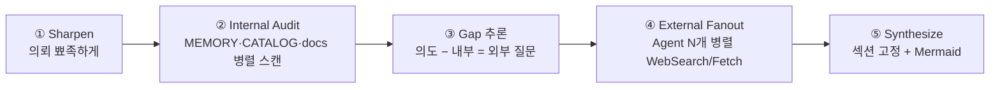

# /research — 내부 감사 기반 외부 조사 & 합성

> **목적**: 의뢰 의도와 프로젝트 내부 자산 사이의 갭을 정의한 뒤, 외부 지식으로 그 갭을 메워 **Best Practice / de facto 표준 / 인사이트풀 대안** 중 하나로 태깅된 reference 문서를 만든다.
> **핵심 가치**: 외부 조사 전에 내부를 먼저 본다. 이미 있는 걸 재발명하거나, 프로젝트가 의도적으로 거부한 표준을 되제안하는 것을 구조적으로 차단.

---

## /explain과의 구분

| | /explain | /research |
|---|---|---|
| **소스** | 내부 (코드, git, 프로젝트 문서) | **내부 감사 + 외부 조사** |
| **질문** | "우리가 왜 이렇게 했지?" | "세상은 이걸 어떻게 풀지? 우리 규약과 어떻게 정합?" |
| **산출물** | 민토 피라미드 해설 문서 | Why/How/What/What-if/Story/Insight/요약 + Mermaid |

---

## 4단 파이프라인



### ① Sharpen

의뢰를 받으면 먼저 한 턴으로 샤프닝한다. 주제가 1~2문장으로 뾰족하면 그대로 진행, 모호하면 /discuss 스타일로 1~3턴 루프.

**모드 태깅 (필수)**:
- `bp` — Best Practice: 공식 가이드·스펙·권위 레퍼런스의 권장 경로
- `defacto` — 사실상 표준: 생태계가 채택한 관행 (주요 프레임워크·npm trends·GitHub usage)
- `alternative` — 인사이트풀 대안: 주류를 벗어난 길, 새로운 관점, 반대 진영

### ② Internal Audit (병렬)

외부 조사 전에 내부부터 스캔한다. Agent 3개 병렬 디스패치:

- **Agent A — 규칙·memory**: `AGENTS.md`, `CLAUDE.md`, memory, feedback 등에서 관련 규약·이미 결정된 방향 추출
- **Agent B — 코드베이스**: 인벤토리 문서(`CATALOG.md` 등)가 있으면 우선 읽고, 관련 부품·패턴·훅 스캔
- **Agent C — docs**: 기존 문서·이전 조사·PRD·아카이브에서 중복 여부 확인

출력 형식:
```
[이미 결정된 것] — MEMORY의 feedback/project에 명시된 방향
[이미 있는 부품] — 재사용 가능한 내부 자산
[이미 조사된 것] — 중복 조사 회피
```

### ③ Gap 추론

```
의뢰 의도 − 내부 자산 = 외부에 물어야 할 질문 N개
```

**규약 충돌 사전 경고 필수**: 의뢰가 스코프 안의 기존 결정과 어긋나면 여기서 플래그. 예: "사용자가 라이브러리 A 도입 BP를 물었으나 이 프로젝트는 의도적으로 무의존 구현을 택했다. 외부 조사는 도입 권장이 아니라 원리 비교 차원에서 수행."

### ④ External Fanout (병렬)

Gap 질문당 Agent 1개 디스패치. 모드별 쿼리 프리셋:

- `bp` → MDN·W3C·공식 프레임워크 docs·ARIA APG·RFC
- `defacto` → GitHub 검색·npm trends·주요 프레임워크 튜토리얼·Stack Overflow 상위 답변
- `alternative` → 컨퍼런스 토크·엔지니어링 블로그·논문·반대 진영 라이브러리

각 에이전트는 원자료 + 출처 URL + 핵심 인용을 반환.

### ⑤ Synthesize

단일 문서로 합성. **섹션 고정 (순서 변경 금지)**:

```markdown
---
type: reference
mode: bp | defacto | alternative
query: "샤프닝된 질문 한 줄"
internalGap: "의뢰 의도 − 내부 자산"
tags: [...]
---

# {주제}

## TL;DR
3~5줄 요약.

## Why — 왜 이 질문이 지금 중요한가
프로젝트 맥락에서의 중요도. Internal Audit ③에서 나온 갭을 여기에.

## How — 표준/BP 방식의 핵심 메커니즘
```mermaid
flowchart TD
  ...사고 시각화 (필수): 개념 간 관계·의사결정 흐름·대안 분기
```

## What — 구체 API·패턴·예시 코드
실제 코드 스니펫, 인터페이스, 단계별 절차.

## What-if — 응용·확장
"우리 프로젝트에 적용하면?" 이 섹션이 조사를 실천 지식으로 바꾼다.

## 흥미로운 이야기
맥락·역사·논쟁·왜 이렇게 됐는가. 조사가 지루해지지 않게 하는 섹션.

## Insight
AI의 한 줄 결론 + **스코프 규칙과의 정합성 판정** (일치/부분 충돌/완전 충돌).

## 출처
- [제목](URL) — 한 줄 요약
- ...
```

**Mermaid 사고 시각화 (필수)**:
- `How` 섹션에 최소 1개 다이어그램
- 다이어그램 타입은 내용에 맞게: `flowchart`(흐름·의사결정), `sequenceDiagram`(상호작용), `stateDiagram-v2`(상태), `mindmap`(개념 분기), `quadrantChart`(2x2 포지셔닝)
- 개념을 나열만 하면 안 됨 — **관계·분기·대비**가 보여야 함

### 저장

저장 위치는 프로젝트의 기존 문서 관행을 따른다. `docs/`, `documentation/`, `wiki/` 등이 있으면 그 구조와 파일명 규칙을 1~2개 샘플로 확인한다. 관행이 없거나 모호하면 대화 안에 출력하고, 파일 저장은 사용자에게 경로를 확인받은 뒤 수행한다.

---

## 실행 규칙

- **내부 감사 없이 외부 조사 금지**. ②를 건너뛰면 안 됨.
- **규약 충돌 시 스코프 규칙 우선**. 외부 BP가 프로젝트·도구·개인 규칙과 충돌하면 Insight에 명시하되 "표준이니까 바꾸자"고 주장하지 않는다.
- **모드 태깅 필수**. 섹션 강약을 모드에 맞게 조절.
- **출처 없는 주장 금지**. 모든 외부 사실은 URL 출처 첨부.
- **Mermaid 최소 1개**. 사고 시각화가 이 스킬의 정체성.
