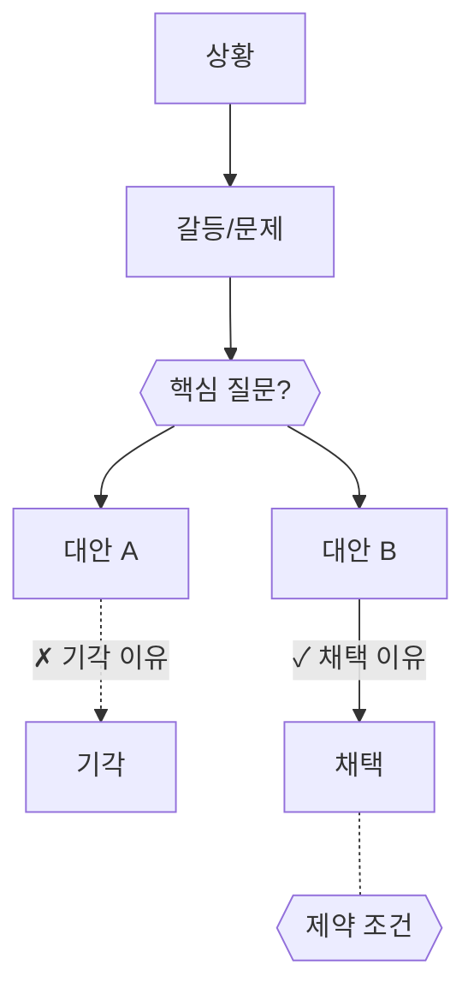

## /archive — 완료 문서 압축 + 아카이브

> **산출물**: `docs/4-archive/{범주}/summary.md`에 섹션 추가 + 원본을 `{범주}/archive/`로 이동
> **원칙**: 불릿이 스토리를 전달하고, mermaid가 구조를 시각화한다. 코드가 못 말하는 것만 남긴다.

---

### Step 0: 대상 결정

1. **인자가 있으면** → 해당 파일(들)을 대상으로
2. **인자가 없으면** → 4-archive/ 루트 또는 2-areas/*/prds/ 에서 범주화 가능한 후보를 제안

```
📦 아카이브 대상: [파일 경로]
📁 범주: [engine / axis / cms / design / ui / meta / ...]
```

---

### Step 1: 완료 판정 (역PRD 체크)

PRD의 핵심 요구사항을 추출하고, 코드에서 구현 여부를 확인한다.

- 구현 확인됨 → 진행
- 미구현 발견 → 사용자에게 보고, 중단 또는 부분 아카이브 선택

`--skip-check` 인자가 있으면 이 단계를 건너뛴다 (사용자가 완료 확신).

---

### Step 2: SCQA 불릿 + Mermaid Decision Map 생성

#### 불릿 포맷 (명사형 종결어미)

```markdown
- 상황 설명
- → 그래서 발생한 갈등/문제
- **핵심 질문?**
  - 해결책 1
  - 해결책 2 / 제약
```

- 첫 불릿: 배경/상황 (flat)
- 두 번째: `→` 화살표로 인과 연결, 갈등/문제
- 세 번째: **bold** + `?`로 핵심 질문
- indent 불릿: 해결책, 제약, 교훈

#### Mermaid Decision Map (WHY→HOW→WHAT→IF)



규칙:
- **S→C**: 상황에서 문제로의 인과
- **C→Q**: `{{}}` 다이아몬드, 핵심 질문
- **Q→선택지**: 검토한 대안 전부
- **채택**: 실선 `--` + 이유
- **기각**: 점선 `-.` + 이유
- **제약**: `{{}}` 다이아몬드, 채택이 유효한 전제 조건

**버리는 것**: 구현 상세, 파일 목록, API 시그니처, 단계별 plan (코드에 있음)

---

### Step 3: 파일 배치 + 이동

구조:
```
docs/4-archive/{범주}/
  summary.md              ← 범주별 요약 (섹션 누적)
  archive/
    원본파일1.md
    원본파일2.md
```

1. **`{범주}/summary.md`에 섹션 추가** (없으면 파일 생성):

```markdown
## {제목} ({날짜})

- 상황 설명
- → 갈등/문제
- **핵심 질문?**
  - 해결책
  - 제약


> 원본: [archive/{원본 파일명}](archive/{원본 파일명})
```

2. **원본 이동**: `git mv {원본} docs/4-archive/{범주}/archive/`
3. **참조 갱신**: PROGRESS.md 등에서 원본 링크가 있으면 summary 링크로 교체

---

### Step 4: 완료 보고

```
✅ 아카이브 완료
- 범주: {범주}
- 추가: summary.md에 {N}개 섹션
- 이동: archive/에 원본 {N}개
```

---

## 소급 모드

인자 없이 호출하면 소급 후보를 제안한다. 우선순위:
1. 4-archive/ 루트에 flat으로 남은 파일 (범주화 안 됨)
2. 같은 범주에 속하는 파일이 여러 개 있는 것 (한번에 묶기)
3. 가장 오래된 것부터

---

## /handoff 연동

/handoff(나가는 길) 마지막에서, 방금 완료된 PRD가 있으면:
```
💡 이 PRD를 아카이브할까요? → /archive {경로}
```
