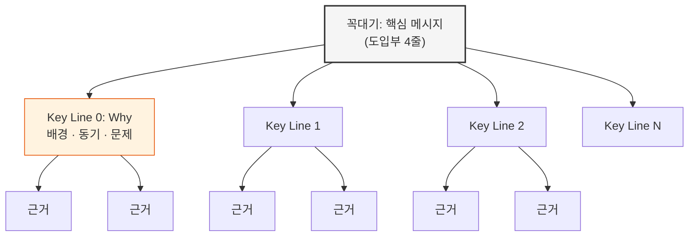
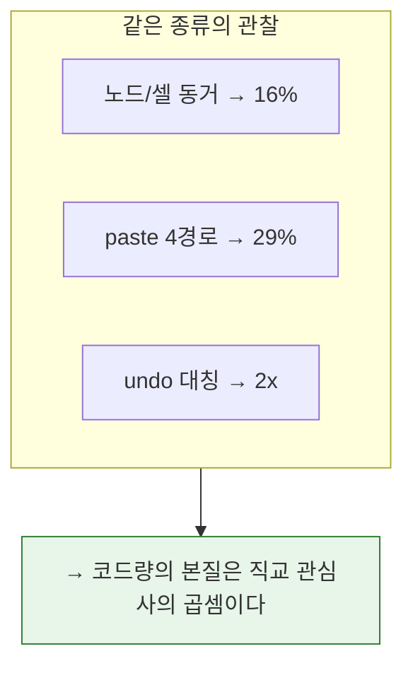
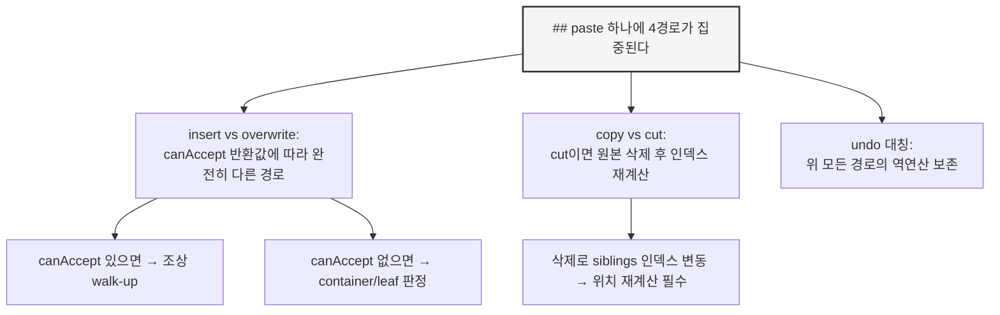

## /explain — 맥락 해설 문서 생성

> **산출물**: 해설 문서 (Mermaid 포함). 프로젝트에 문서 폴더가 있으면 거기에 저장, 없으면 대화 내 출력.
> **원칙**: 답을 먼저, 근거를 나중에. 나열은 해설이 아니다.

---

### Step 0: 대상 결정

1. **인자가 있으면** → 그 대상을 해설한다
2. **인자가 없으면** → 대화 맥락에서 추론하되, 모호하면 묻는다

```
📖 해설 대상: [대상명] — [한 줄 설명]
```

---

### Step 1: 소스 수집

코드와 문서를 **직접 읽는다** — 기억에 의존하지 않는다.

| 수집 대상 | 방법 |
|----------|------|
| 코드 구조 | 핵심 파일 read, grep으로 의존 관계 추적 |
| 프로젝트 맥락 | README, ARCHITECTURE, PROGRESS, docs/ 등 프로젝트에 존재하는 문서 |
| 변경 이력 | git log, git diff |
| 설계 의도 | CLAUDE.md, ADR, RFC, discussion, PRD 등 프로젝트에 존재하는 의사결정 기록 |

> 프로젝트마다 문서 구조가 다르다. 위 테이블은 "무엇을 찾느냐"이지 "어디에 있느냐"가 아니다. 먼저 프로젝트 루트를 훑어서 어떤 문서가 있는지 파악하고, 있는 것만 읽는다.

---

### Step 2: 피라미드 구축 — 미괄식으로 사고하고, 두괄식으로 쓴다

피라미드의 **표현**은 두괄식(답 먼저)이지만, **구축**은 미괄식(데이터 먼저)이다. 결론을 먼저 정하고 근거를 찾으면 확정편향이 생긴다 — 근거를 먼저 모으고 결론을 도출해야 데이터에 기반한 분류와 drill-down이 나온다.

#### 구축 순서 (사고 과정)

1. **Warrant 수집**: 소스를 읽으며 사실만 기록한다 (파일명, 줄 수, 사용 슬롯, 의존 관계, 특이사항). 결론을 내리지 않는다.
2. **귀납적 그룹핑**: 수집한 사실을 분류하고, 각 그룹에 "그래서?" 질문. 결론이 데이터에서 올라오게 한다.
3. **로직트리 점검**: 도출된 결론과 Key Line이 warrant에서 실제로 따라오는지 확인.
4. **두괄식 배치**: 검증된 결론을 꼭대기에 놓고, 아래 원칙대로 피라미드를 쌓는다.

#### 표현 원칙 (문서 구조)

민토의 피라미드 3원칙:
1. **꼭대기에 답을 놓는다** — 도입부 4줄이 문서 전체의 결론
2. **수직 관계**: 아래 층은 윗 층의 "왜?" 또는 "어떻게?"에 답한다
3. **수평 관계**: 같은 층의 항목들은 연역 또는 귀납으로 정렬한다



#### 꼭대기: 도입부

라벨 없는 4줄 블릿으로 문서 전체를 요약한다. 이것만 읽어도 답을 알 수 있어야 한다.

```markdown
> - clipboard.ts는 444줄로 plugins/ 최대 파일이다
> - 단일 기능이지만 4가지 직교 관심사가 한 파일에 합류했다
> - 왜 이 파일이 길어질 수밖에 없는 구조인가?
> - 2축(노드/셀) × 2축(insert/overwrite) × undo 대칭이 코드량의 본질이다
```

#### 첫 번째 섹션은 항상 Why다

도입부 직후의 `##` 섹션은 **반드시 배경/동기/문제** 중 하나를 다룬다. 독자가 "왜 이걸 알아야 하지?"를 먼저 이해해야 나머지 Key Line이 의미를 갖기 때문이다.

Why 섹션이 다루는 것 (질문에 따라 달라짐):
- **설계 해설**: 어떤 문제가 이 설계를 강제했는가? (예: "clipboard singleton 오염이 아키텍처를 강제했다")
- **진단/분석**: 이 증상이 왜 문제인가? (예: "444줄은 plugins/ 최대이며 읽기 비용이 높다")
- **패턴 해설**: 왜 이런 구조가 존재하는가? (예: "엔진은 빈 껍데기, 행위는 플러그인이 소유한다")

Why도 Insight 제목이어야 한다 — `## 배경`이 아니라 `## clipboard singleton 오염이 아키텍처를 강제했다`.

#### Key Line: Insight 제목이 되는 핵심 주장들

Why 이후의 나머지 Key Lines. 꼭대기 답을 뒷받침하는 핵심 주장 2~4개. 각각이 문서의 `##` 섹션이 된다.

**제목 = 주장 (Heading as Insight)**: 섹션 제목은 라벨이 아니라 그 섹션의 결론이다.

| 나쁜 예 (라벨) | 좋은 예 (주장) |
|---------------|---------------|
| `## 배경` | `## 기존 미들웨어는 세션 토큰을 평문 저장한다` |
| `## 구조` | `## Zod 스키마 단일 소스에서 15개 타입을 파생한다` |
| `## 원인 1` | `## paste 하나에 4경로가 집중되어 107줄을 차지한다` |

**Key Line 선정 테스트**: 모든 Key Line 제목을 나열했을 때, 그것만으로 문서의 논지가 전달되는가?

#### 수평 관계: Key Line을 어떻게 정렬할 것인가

같은 층의 항목들은 **논리적 순서**가 있어야 한다. 두 가지 방법 중 하나를 선택한다.

**연역 순서** — 전제 → 전제 → 결론 체인


각 단계가 다음 단계의 전제가 된다. 설계 철학, 인과 관계, 의사결정 과정을 설명할 때 적합하다. 하나라도 빠지면 결론이 서지 않으므로 빈틈을 잡기 좋다.

**귀납 순서** — 같은 종류를 모아서 "그래서?" 결론



독립적 관찰을 모아서 패턴/결론을 도출한다. 원인 분석, 비교, 사례 연구에 적합하다. **MECE**(상호배타, 전체포괄)를 점검한다 — 빠진 관찰은 없는가? 겹치는 관찰은 없는가?

#### 수직 관계: 각 Key Line 아래의 근거

Key Line 하나를 꼭대기로 하는 **하위 피라미드**를 만든다. 같은 원칙이 재귀적으로 적용된다:

- 아래 층은 윗 층의 "왜?" 또는 "어떻게?"에 답한다
- 같은 층끼리는 연역 또는 귀납으로 정렬한다
- 필요한 만큼 깊이 파되, 보통 2-3층이면 충분하다



---

### Step 3: Mermaid 다이어그램

> Mermaid 없는 /explain 문서는 불완전하다.

다이어그램은 피라미드 구조를 시각적으로 전달하는 도구다. **글 전에 다이어그램을 먼저 보여주고, 글로 보충한다.**

#### 다이어그램을 넣어야 하는 곳

| 신호 | Mermaid 유형 |
|------|-------------|
| "A 하면 B가 되고…" 흐름이 보이면 | `flowchart` |
| "먼저 X, 그다음 Y가…" 시간순이면 | `sequenceDiagram` |
| "이 안에 저게 들어있고…" 포함이면 | `graph TD` + subgraph |
| "A는 이렇고 B는 저렇고…" 대비이면 | 좌우 subgraph |
| "이것과 저것이 연결되어…" 관계이면 | `erDiagram` |
| "상태가 A에서 B로…" 전이이면 | `stateDiagram-v2` |

#### 규칙

- **최소 2개** — 피라미드의 서로 다른 층을 각각 시각화
- 노드 20개 이하 (초과 시 분할)
- 라벨에 `(`, `)`, `/` → `["label"]`로 감싸기
- 색상/형태 구분 → 다이어그램 직후 **범례 표**

#### 선호 패턴

```markdown
## [Insight 제목]

[결론 1문장]

` ` `mermaid
[구조 시각화]
` ` `

[다이어그램이 보여주는 것에 대한 보충 + 정량 데이터]

→ 시사점
```

---

### Step 4: 글쓰기 규율

피라미드를 문서로 옮길 때 지키는 규율이다.

**결론 선행**: 각 섹션의 첫 문장이 결론이다. 나머지는 근거.

**So What 마무리**: 모든 섹션 끝에 `→ 시사점` 한 줄. 사실만 나열하고 끝나면 로그이지 해설이 아니다.

**정량 근거 우선**: "길다" 대신 "107줄, 전체의 29%". "많다" 대신 "18개 소비처". 수치가 있으면 수치를 쓴다.

**톤**: 기술 문서. 감탄사/수사적 질문 금지. 코드 인용은 핵심만 발췌.

**섹션 수**: 피라미드가 요구하는 만큼. 고정 N섹션이 아니라 내용이 구조를 결정한다.

---

### Step 5: 문서 구조

```markdown
# [대상명] — [한 줄 설명]

> 작성일: YYYY-MM-DD
> 맥락: [배경 1문장]

> - [현재 상태 — 사실]
> - [문제/긴장 — "그런데…"]
> - [이 문서가 답하는 질문]
> - [한 줄 결론 — 문서 전체의 꼭대기]

---

## [Why — Insight 제목: 이 대상이 존재하는 배경/동기/문제]

[결론 첫 문장]

[근거: 배경, 문제 상황, 동기]

` ` `mermaid
[문제 구조 시각화]
` ` `

→ 시사점

---

## [Key Line 1 — Insight 제목]

[결론 첫 문장]

[근거: 코드 인용, 정량 데이터, 비교]

` ` `mermaid
[시각화]
` ` `

→ 시사점

---

## [Key Line N — Insight 제목]

…
```

---

### Step 6: 저장 + 보고

저장 위치는 프로젝트 관습에 따른다:

| 프로젝트 상태 | 저장 위치 |
|-------------|----------|
| `docs/0-inbox/` 같은 inbox 폴더가 있으면 | 거기에 `{순번}-[explain]{대상명}.md` |
| `docs/` 폴더만 있으면 | `docs/explain-{대상명}.md` |
| 문서 폴더가 없으면 | 대화 내에서 직접 출력 (파일 생성 안 함) |

보고: 핵심 요약 3-5줄 + 파일 경로 (저장한 경우)
